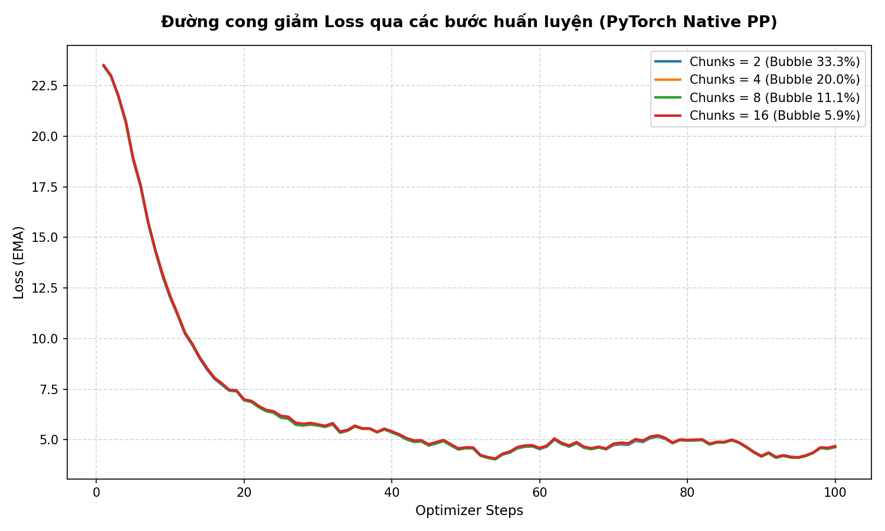
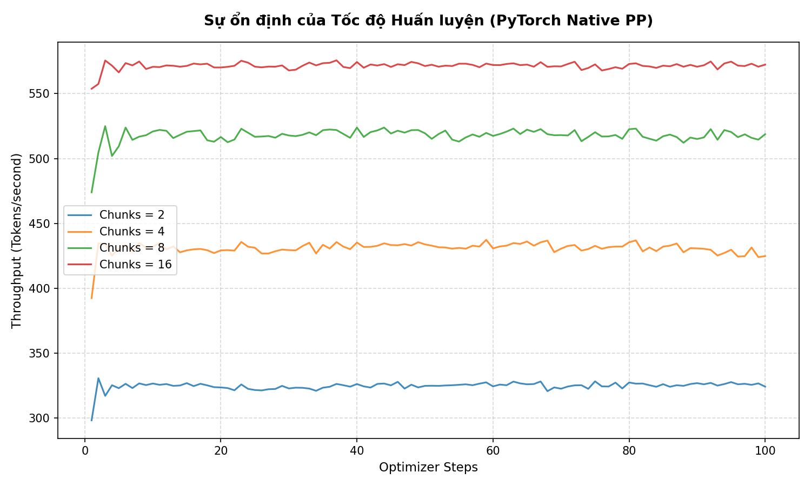
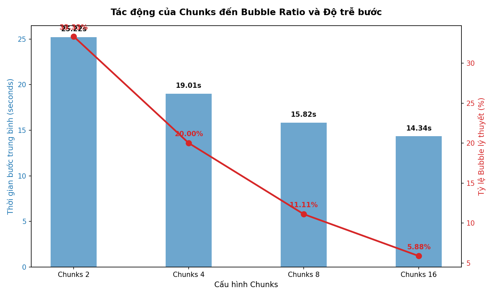
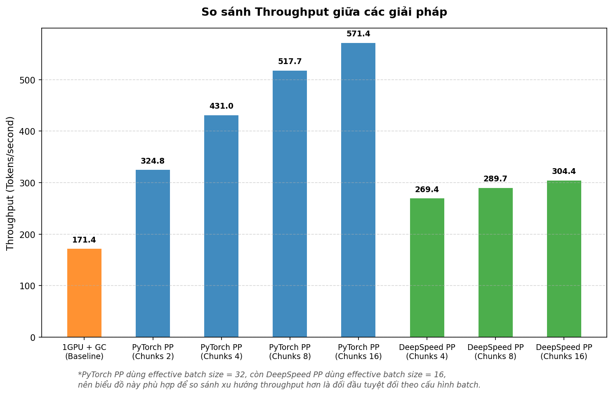
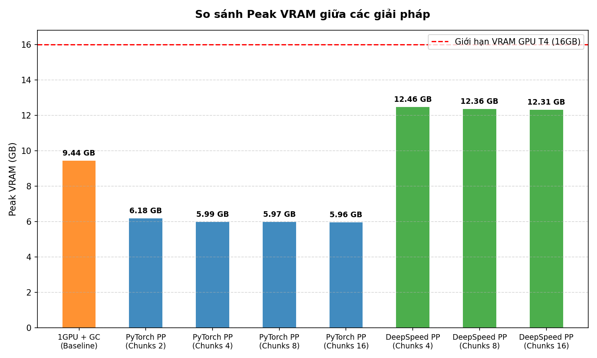

# Huấn luyện song song GPT-2 XL trên 2 GPU T4

Repo này ghi lại quá trình thử nghiệm huấn luyện `gpt2-xl` trong bối cảnh một GPU T4 16GB không đủ dư địa để giữ toàn bộ activations nếu chạy theo kiểu 1 GPU thông thường. Mục tiêu là so sánh ba hướng:

- `1 GPU + Gradient Checkpointing`
- `2 GPU + PyTorch Native Pipeline Parallelism`
- `2 GPU + DeepSpeed Pipeline Parallelism`

Nguồn số liệu trong README này được lấy trực tiếp từ:

- Notebook thực nghiệm: [final-version.ipynb](final-version.ipynb)
- Baseline 1 GPU: [log/step2_metrics.json](log/step2_metrics.json)
- PyTorch pipeline: [log/pytorch_metrics.json](log/pytorch_metrics.json)
- DeepSpeed pipeline: [log/step3_deepspeed_metrics.json](log/step3_deepspeed_metrics.json)

## 1. Bài toán

`gpt2-xl` có 48 transformer blocks và khoảng 1.5B tham số. Dù đã dùng `bfloat16` và `AdamW8bit`, bài toán không chỉ nằm ở weights mà còn ở activations, gradients và optimizer states. Với batch đủ lớn để huấn luyện có ý nghĩa, 1 GPU T4 dễ rơi vào `CUDA Out Of Memory`.

Repo này đi từ baseline bị giới hạn trên 1 GPU, sau đó tối ưu bằng gradient checkpointing, rồi chuyển sang pipeline parallelism trên 2 GPU để giảm memory pressure và tăng throughput.

## 2. Cấu hình thực nghiệm

### Phần cứng

- 2 x NVIDIA Tesla T4
- 16GB VRAM mỗi GPU
- NCCL backend cho giao tiếp liên GPU

### Mô hình và dữ liệu

- Model: `gpt2-xl`
- Sequence length: `256`
- Tokenizer/dataset: `wikitext`, cấu hình `wikitext-2-raw-v1`
- Dtype: `torch.bfloat16`
- Optimizer: `bitsandbytes.optim.AdamW8bit`

### Các script chính

- OOM demo 1 GPU: [src/baseline_1gpu.py](src/baseline_1gpu.py)
- 1 GPU + gradient checkpointing: [src/gradient_checkpointing_1gpu.py](src/gradient_checkpointing_1gpu.py)
- 2 GPU + PyTorch native pipeline: [src/pytorch_2gpu.py](src/pytorch_2gpu.py)
- 2 GPU + DeepSpeed pipeline: [src/deepspeed_2gpu.py](src/deepspeed_2gpu.py)
- Vẽ biểu đồ từ log: [plot_charts.py](plot_charts.py)

## 3. Thiết kế từng bước

### Bước 1: OOM demo trên 1 GPU

`src/baseline_1gpu.py` chạy `gpt2-xl` theo cách trực tiếp trên 1 GPU với:

- `BATCH_SIZE = 3`
- `GRAD_ACCUM = 2`
- `bf16`
- `AdamW8bit`
- không bật gradient checkpointing

Mục đích của bước này là tái hiện giới hạn memory và dùng nó làm mốc để so với các bước tối ưu phía sau.

### Bước 2: 1 GPU + Gradient Checkpointing

`src/gradient_checkpointing_1gpu.py` giữ nguyên tinh thần chạy 1 GPU nhưng bật `model.gradient_checkpointing_enable()` để đánh đổi compute lấy VRAM. Đây là baseline “tiết kiệm phần cứng nhất” trong repo.

### Bước 3: 2 GPU + PyTorch Native Pipeline Parallelism

`src/pytorch_2gpu.py` chia model thành 2 stage thủ công:

- GPU 0: embedding + 24 blocks đầu
- GPU 1: 24 blocks sau + `ln_f` + `lm_head`

Batch được chia thành nhiều `chunks` để giảm pipeline bubble. Repo hiện có log cho `chunks = 2, 4, 8, 16`.

### Bước 4: 2 GPU + DeepSpeed Pipeline Parallelism

`src/deepspeed_2gpu.py` dùng `deepspeed.PipelineModule`, vẫn chia model thành 2 stage nhưng để DeepSpeed quản lý pipeline runtime và kết hợp thêm `ZeRO stage 1`. Repo hiện có log cho `chunks = 4, 8, 16`.

## 4. Bubble ratio và ý nghĩa của chunks

Với pipeline parallelism, một phần thời gian GPU sẽ ở trạng thái chờ stage trước/sau. Tỷ lệ chờ lý thuyết:

`bubble_ratio = (p - 1) / (m + p - 1)`

Trong đó:

- `p`: số stage, ở đây là `2`
- `m`: số micro-batches hay `chunks`

Khi tăng `chunks`, bubble ratio giảm:

| Chunks | Bubble ratio |
| :--: | --: |
| 2 | 33.33% |
| 4 | 20.00% |
| 8 | 11.11% |
| 16 | 5.88% |

Đây là lý do cả PyTorch PP lẫn DeepSpeed PP đều cải thiện throughput khi tăng chunks trong cùng một họ cấu hình.

## 5. Kết quả thực nghiệm

### Tóm tắt nhanh

| Phương án | Cấu hình đại diện | Throughput (tok/s) | Sec/step | Peak VRAM (GB) | Final loss |
| :-- | :-- | --: | --: | --: | --: |
| 1 GPU + GC | batch 3, grad accum 2 | 171.4 | 8.968 | 9.436 | 0.3978 |
| PyTorch PP tốt nhất | chunks 16 | 571.4 | 14.336 | 5.964 | 5.1786 |
| DeepSpeed PP tốt nhất | chunks 16 | 304.4 | 13.458 | 12.309 | 2.6875 |

### Kết quả 1 GPU + Gradient Checkpointing

| Metric | Value |
| :-- | --: |
| Steps | 100 |
| Throughput | 171.4 tok/s |
| Avg sec/step | 8.968 |
| Peak VRAM | 9.436 GB |
| Final loss | 0.3978 |
| Total time | 896.9 s |

Nhận xét:

- Cấu hình này là mốc ít tốn phần cứng nhất vì chỉ dùng 1 GPU.
- Peak VRAM vẫn nằm dưới 16GB nên có thể chạy ổn định.
- Throughput thấp hơn rõ rệt so với pipeline 2 GPU.

### Kết quả 2 GPU + PyTorch Native Pipeline

| Chunks | Bubble | Throughput (tok/s) | Sec/step | Peak VRAM (GB) | Final loss |
| :--: | --: | --: | --: | --: | --: |
| 2 | 33.33% | 324.8 | 25.224 | 6.182 | 5.1055 |
| 4 | 20.00% | 431.0 | 19.010 | 5.985 | 5.1055 |
| 8 | 11.11% | 517.7 | 15.825 | 5.973 | 5.0891 |
| 16 | 5.88% | 571.4 | 14.336 | 5.964 | 5.1786 |

Nhận xét:

- Throughput tăng liên tục từ `324.8` lên `571.4 tok/s` khi tăng chunks từ `2` lên `16`.
- Bubble ratio giảm từ `33.33%` xuống `5.88%`, đi cùng với việc `sec/step` giảm mạnh từ `25.224` xuống `14.336`.
- Peak VRAM khá ổn định quanh `~6GB`, thấp hơn đáng kể so với giới hạn 16GB của T4.

### Kết quả 2 GPU + DeepSpeed Pipeline

| Chunks | Bubble | Throughput (tok/s) | Sec/step | Peak VRAM (GB) | Final loss |
| :--: | --: | --: | --: | --: | --: |
| 4 | 20.00% | 269.4 | 15.212 | 12.464 | 2.7188 |
| 8 | 11.11% | 289.7 | 14.139 | 12.361 | 2.6875 |
| 16 | 5.88% | 304.4 | 13.458 | 12.309 | 2.6875 |

Nhận xét:

- DeepSpeed cũng hưởng lợi rõ từ việc tăng chunks: throughput tăng từ `269.4` lên `304.4 tok/s`.
- `sec/step` giảm đều từ `15.212` xuống `13.458`.
- Peak VRAM cao hơn cấu hình PyTorch PP trong repo hiện tại, dao động quanh `12.3GB`.

### So sánh trực tiếp theo hướng ra quyết định

| Tiêu chí | 1 GPU + GC | PyTorch PP | DeepSpeed PP |
| :-- | :-- | :-- | :-- |
| Mức dùng GPU | 1 GPU | 2 GPU | 2 GPU |
| Throughput tốt nhất trong repo | 171.4 tok/s | 571.4 tok/s | 304.4 tok/s |
| Peak VRAM tốt nhất trong repo | 9.436 GB | 5.964 GB | 12.309 GB |
| Xu hướng khi tăng chunks | Không áp dụng | Tăng tốc rõ | Tăng tốc vừa |
| Độ minh bạch khi debug | Cao | Cao | Trung bình |
| Độ tự động hóa runtime | Thấp | Trung bình | Cao |

Kết luận ngắn:

- Nếu ưu tiên tốc độ trong repo này, `PyTorch PP (chunks 16)` là cấu hình tốt nhất.
- Nếu ưu tiên ít GPU nhất, `1 GPU + GC` là mốc baseline hợp lý.
- DeepSpeed vẫn hữu ích khi bạn cần runtime pipeline tiện hơn hoặc muốn tiếp tục khai thác hệ sinh thái ZeRO, nhưng ở bộ log hiện tại nó không thắng PyTorch PP về throughput hay peak VRAM.

### Lưu ý khi đọc throughput

Không nên diễn giải throughput giữa PyTorch PP và DeepSpeed PP như một cuộc so găng tuyệt đối 1:1, vì batch hiệu dụng khác nhau:

- PyTorch PP trong repo này dùng `BATCH_SIZE = 16`, `GRAD_ACCUM = 2`, tức effective batch size `32`
- DeepSpeed PP dùng `EFFECTIVE_BS = 16`

Vì vậy, nên dùng bảng này để so sánh xu hướng scaling theo `chunks` và memory behavior trước, rồi mới tinh chỉnh batch để benchmark công bằng hơn.

## 6. Biểu đồ

Các biểu đồ dưới đây được tạo từ [plot_charts.py](plot_charts.py) và thư mục `log/`.

### 1. Loss curves của PyTorch pipeline



### 2. Throughput stability của PyTorch pipeline



### 3. Tương quan giữa chunks, bubble và độ trễ



### 4. So sánh throughput giữa các giải pháp



### 5. So sánh peak VRAM giữa các giải pháp



## 7. Cách chạy lại

### Cài dependencies

```bash
pip install -q datasets bitsandbytes deepspeed accelerate matplotlib numpy transformers
```

### Chạy từng bước

```bash
python src/baseline_1gpu.py
python src/gradient_checkpointing_1gpu.py
python src/pytorch_2gpu.py
python src/deepspeed_2gpu.py
```

### Vẽ lại toàn bộ biểu đồ

```bash
python3 plot_charts.py
```

## 8. Cấu trúc output đáng chú ý

- `log/step2_metrics.json`: metrics của baseline 1 GPU + GC
- `log/pytorch_metrics.json`: metrics PyTorch PP theo từng cấu hình chunks
- `log/step3_deepspeed_metrics.json`: metrics DeepSpeed PP theo từng cấu hình chunks
- `charts/`: ảnh biểu đồ dùng cho README

## 9. Gợi ý mở rộng

- Chuẩn hóa effective batch size giữa PyTorch PP và DeepSpeed PP để benchmark công bằng hơn.
- Thêm cấu hình `chunks > 16` để xem ngưỡng diminishing returns.
- Đo thêm GPU utilization và NCCL communication overhead để giải thích sâu hơn chênh lệch giữa hai pipeline runtime.
